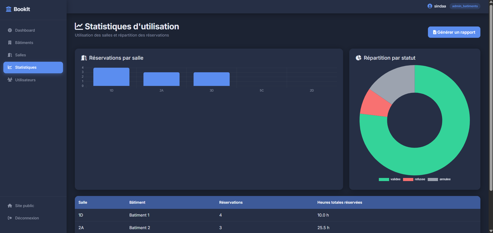

# 🏛️ BookIt — Smart Room Reservation System

BookIt is a full-stack room reservation platform built with vanilla PHP 8, following a strict MVC architecture with no framework. It was developed as an academic project at ESPRIT (École Supérieure Privée d'Ingénierie et de Technologies), and covers the complete lifecycle of managing buildings, rooms, and reservations across three distinct user roles.

## ✨ Features

### 🔑 Authentication & Roles
- Secure registration/login with hashed passwords
- Three roles with strict server-side access control: **Building Admin**, **Reservation Manager**, **User**

### 🏢 Building Admin
- CRUD for buildings and floors
- CRUD for rooms (capacity, equipment, location) with instant availability/maintenance toggling
- Usage statistics dashboard (Chart.js) — bookings per room, status breakdown
- Period-based reservation reports with a generated **PDF export** (insights: busiest room, busiest day, average booking duration, validation rate)

### 📋 Reservation Manager
- Multi-criteria search across all reservations (user, room, status, date range)
- Approve / reject pending requests
- Create manual bookings on behalf of a user
- Reschedule an existing reservation (room and/or time), fully conflict-checked

### 👤 User
- Interactive calendar (FullCalendar.js) showing real-time room availability
- Advanced room filters (minimum capacity, building, equipment) before booking
- Book, edit, or cancel their own reservations
- Automatic conflict detection prevents any double-booking
- Email notifications on booking confirmation and status updates

## 🛠️ Tech Stack

| Layer | Technology |
|---|---|
| Backend | PHP 8, custom MVC architecture |
| Database | MySQL, accessed exclusively via **PDO** (prepared statements) |
| Frontend | Bootstrap 5, vanilla JavaScript |
| Calendar | FullCalendar.js |
| Charts | Chart.js |
| Email | PHPMailer (SMTP), with automatic fallback to native `mail()` |
| PDF generation | Dompdf |
| Version control | Git |

No PHP or JavaScript framework (Symfony, Laravel, Angular, etc.) is used — every controller, model, and route is handwritten.

## 🏗️ Architecture

```
BookIt/
├── app/
│   ├── controllers/     # Request handling & business logic orchestration
│   ├── models/          # PDO data access layer (one class per entity)
│   ├── services/        # Cross-cutting concerns (e.g. NotificationService)
│   └── views/
│       ├── frontend/    # User-facing pages (public site, booking, my reservations)
│       └── backend/     # Admin/manager dashboard (sidebar layout)
├── config/              # Database connection (PDO)
├── database/            # SQL schema
├── public/              # Front controller (index.php) & static assets (CSS)
└── vendor/              # Composer dependencies (PHPMailer, Dompdf)
```

**Routing:** a single front controller (`public/index.php`) dispatches requests to `?controller=X&action=Y`, instantiating the matching controller and calling its method — a lightweight routing pattern with no framework overhead.

## 🗄️ Database Schema

Four core entities connected by foreign keys:

```
Utilisateur ──< Réservation >── Salle ──< Étage ──< Bâtiment
```

- `utilisateurs` — accounts and roles
- `batiments` / `etages` — building hierarchy
- `salles` — rooms, linked to a floor, with capacity/equipment/status
- `reservations` — bookings, linked to both a room and a user, with conflict-safe time ranges

## 📸 Screenshots

### Public / User side

| Home Page | Sign In | Log In |
|---|---|---|
|  |  |  |

| Interactive Calendar | My Reservations |
|---|---|
|  |  |

### Admin / Manager side

| Admin Dashboard | Building Management | Room Management |
|---|---|---|
|  |  |  |

| User Management | Reservation Management |
|---|---|
|  |  |

### Stats & Reports

| Stats Dashboard | PDF Export |
|---|---|
|  |  |

## 🚀 Getting Started

1. Clone the repository:
   ```bash
   git clone https://github.com/DhaouSinda/Bookit-SmartBuildingManagement.git
   ```
   and place it in your local server's web root (e.g. `htdocs` for XAMPP)
2. Import `database/schema.sql` into a MySQL database
3. Configure your database credentials in `config/db.php`
4. Install PHP dependencies:
   ```bash
   composer install
   ```
5. (Optional, for real email delivery) Add your SMTP credentials in `app/services/NotificationService.php`
6. Visit `http://localhost/Bookit-SmartBuildingManagement/public/index.php`

## 🔒 Security Highlights

- All database queries use **PDO prepared statements** — no raw SQL concatenation, no injection surface
- Passwords hashed with `password_hash()` / verified with `password_verify()`
- Server-side role checks on every protected route (not just hidden UI elements)
- Booking conflict detection enforced at the database-query level, not just in the UI

## 📌 Project Context

Built as the "Projet Technologies Web" module deliverable, following a fixed academic specification (MVC, PDO-only, no framework, responsive front/back office, conflict management, email notifications, and interactive calendar).

## 👩‍💻 Author

**Sinda Dhaou**
Computer Engineering student at ESPRIT
[LinkedIn](https://linkedin.com/in/sinda-dhaou-2601142a3) · [GitHub](https://github.com/DhaouSinda)